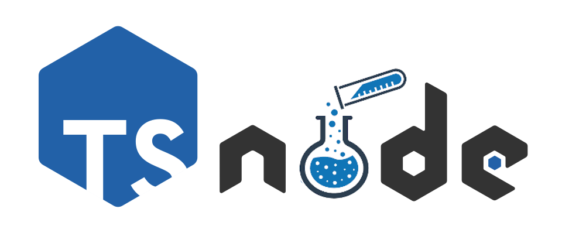

# ts-node-playground
> Project based on the Rust extension by Conrad Ludgate. 
> 
> Thank you for the inspiration!
> 
> [Conrad GitHub Profile](https://github.com/conradludgate)
> 
> [Extension  Repository](https://github.com/conradludgate/vscode-rust-playground)

Extension to easily write and execute TypeScript and Node scripts without having to create a project from scratch or use websites.

## Example

## Features
